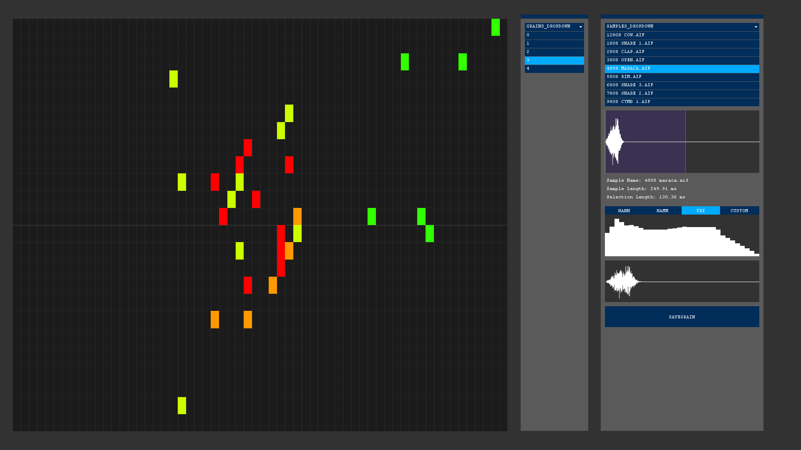
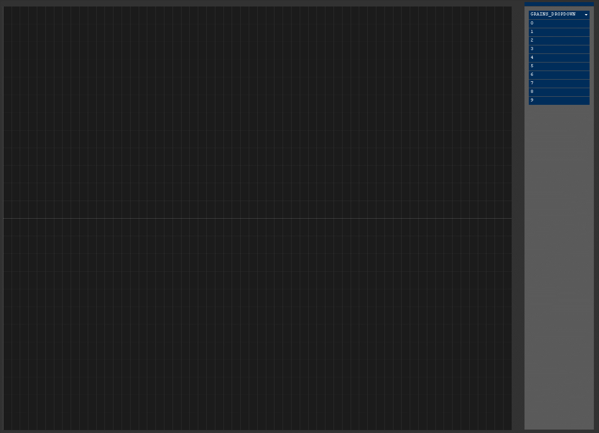
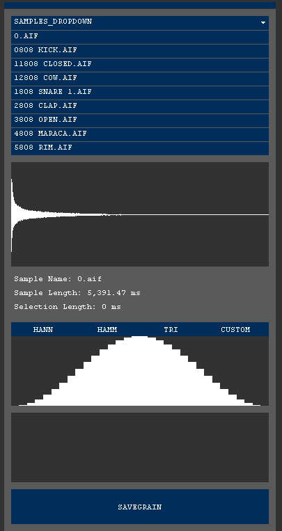

# Speck
**MAT240C *Audio Programming* - Final Project**

*Speck* is a grain sequencer inspired by electronic music notation, granular and image syntheses. Grains can be created by chopping samples and applying an arbitrary envelope. They can be placed onto the canvas by drawing with mouse, and when triggered, the canvas translates spatial pixels into note-like structures whose pitch varies based on the vertical location of the note. 




### Install and Run

- Install [Processing](https://processing.org/download/)

- Add **Minim** and **ControlP5** libraries to Processing

  - *Sketch* -> *Import Library* -> *Add Libraries*
  - Search the name of the library and click *Install*

- Download / clone the files at:  

  ```git clone https://github.com/merttoka/Speck.git```

- Run `speck.pde` in Processing IDE


### Usage 

 


| Key                                      | Interaction                              |
| ---------------------------------------- | ---------------------------------------- |
| `LEFT CLICK` on *wave shape*             | Sets lower bound of grain selection      |
| `RIGHT CLICK` on *wave shape*            | Sets higher bound of grain selection (reverses sample if *min > max*) |
| `LEFT CLICK` on *envelope*               | Draws bins on envelope                   |
| `0` ... `9`                              | Trigger corresponding grain on the dropdown |
| `LEFT CLICK` on *canvas*                 | Places selected grain on the cell of canvas |
| `RIGHT CLICK` on *canvas*                | Removes item from the cell of canvas     |
| ` SPACE`                                 | Start / stop timer on canvas             |
| `UP`/`DOWN`                              | Increment / decrement playback speed     |
| `i`                                      | Load an image into canvas (image path is in `void setup` function) |
| `s`                                      | Save canvas as an image file             |
| `c`                                      | Clear canvas                             |
| [`SHIFT`] + `LEFT ARROW` or `RIGHT ARROW` | Move timer left or right on canvas (`SHIFT` doubles the speed) |

- You can copy sample files to `speck/samples/` directory to populate the samples list.

- The *resolution* of canvas and *total time* of canvas can be modified with `resolution` (*canvas matrix dimension*) and `maxTime` (*milliseconds*) variables at the top of `speck.pde` 

### TODO:
- [x] Assign keyboard numbers to play grains
- [x] Draw normalized grain wave 
- [x] Reverse sample playback on selection
- [x] Adjustable playback speed
- [x] Image selector
- [x] Labels
- [ ] Save grains and canvas on quit
- [ ] Editing Grains (delete, manipulate)
- [ ] Coloring the grain selection dropdown items
- [ ] Interaction improvements
